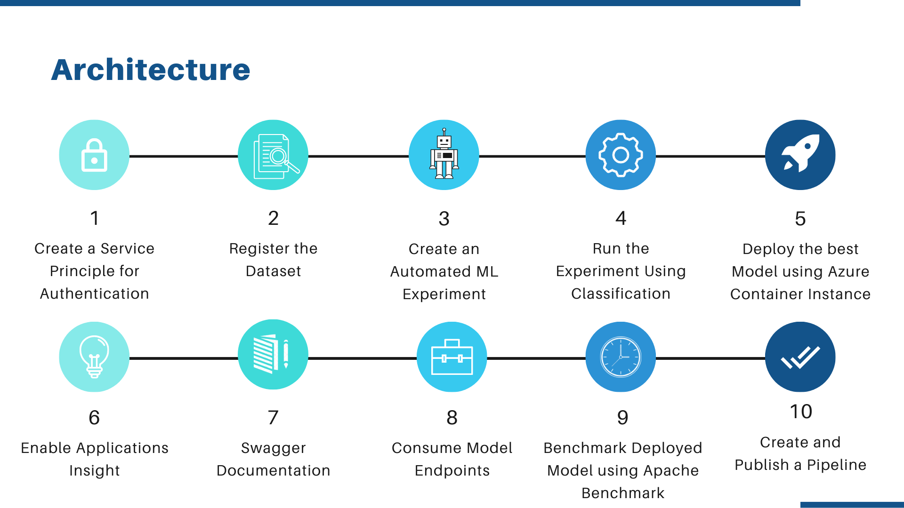
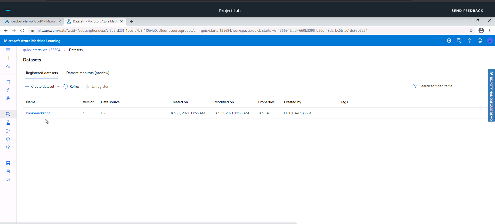
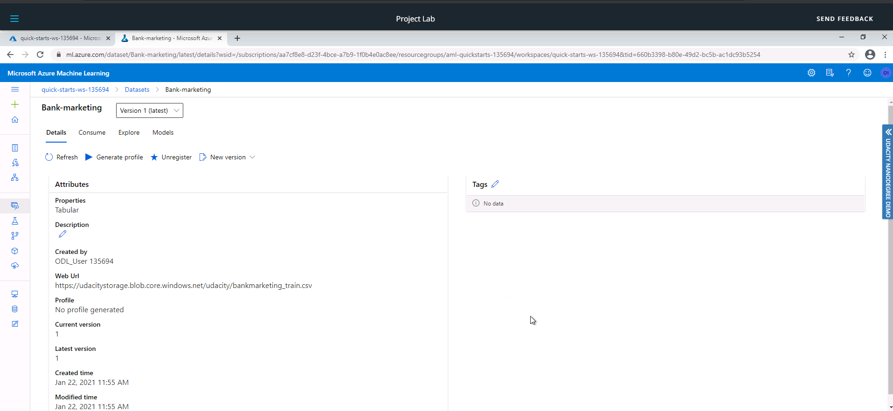

# Operationalizing Machine Learning

In this project we use Microsoft Azure to configure a cloud based Machine Learning model. We also explore the model deployment as an HTTP REST API endpoint, Swagger API documentation, Apache benchmarking of the deployed endpoint and consumption of the endpoint using JSON documents as an HTTP POST request. Finally we see how to create, publish and consume a pipeline using Azure SDK.

The dataset used for this project is the [Bank Marketing](https://archive.ics.uci.edu/ml/datasets/Bank+Marketing) Dataset. 
This data is related with direct marketing campaigns of a Portuguese banking institution (based on phone calls) that whether the person will subscribe to the bank term deposit or not. It contains input attributes such as `age`, `job`, `marital status`, `education` etc and output attribute `y` which has values `yes` or `no` which states whether the client has subscribed to a term deposit or not.

## Architectural Diagram

The following diagram shows the overall architecture of the system.

 

## Key Steps

### Step 1: Authentication

- In this step we enable authentication as it is crucial for the continuous flow of operations.
Authentication types supported by Azure are Key- based, Token- based and Interactive.

- We will also create a Service Principle (SP) and allow the SP to access the workspace we will be working with. Using a service principal is a great way to allow authentication while reducing the scope of permissions, which enhances security.

NOTE: As we are using Azure Account provided by Udacity, we don't need to perform this step.

### Step 2: Automated ML Experiment

In this step, you will create an experiment using Automated ML, configure a compute cluster, and use that cluster to run the experiment.

- First we need to upload the Bank Marketing dataset provided to the datastore.

**Registered Datasets**

**Bank Marketing Dataset Uploaded**

## Screen Recording
Screen recording explaining the steps followed in the project can be viewed using this [Link](https://youtu.be/nQZ4gHd64Wg).

